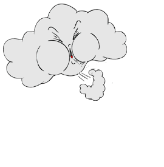

# Simulação de Incêncio com Movimentação de um Animal

**Docente:** Michel Pires da Silva ([mpiress](https://github.com/mpiress))

**Discente:** Júlia de Moura Souza (Engenharia de Computação - CEFETMG)

Coisas para corrigir:
- deixar mais notório a introdução
- colocar o link na função  para a devida parte no código
- montar a struct no readme!
- desenvolver um fluxograma
- computar, ao final do programa, a vida do animal, quantidades de passos

 <table> <tr> <td>
 
### 📖 Sumário
- [Especificação do Problema](#especificação-do-problema)
- [O Algoritmo](#o-algoritmo)
  - [Lógica Utilizada](#lógica-utilizada)
  - [Arquivos 'Config'](#arquivos-config)
  - [Arquivos 'Simulator'](#arquivos-simulator)
  - [Comportamento](#comportamento)
- [Compilação, Entradas e Saídas](#compilação-entradas-e-saídas)
  - [MakeFile](#makefile)
  - [Input.dat](#inputdat)
  - [Output.dat](#outputdat)
- [Referências](#referências)

</td> <td>

 

</td> </tr> </table> 

## Especificação do Problema
Este programa consiste na implementação de um simulador de propagação de incêndios em matrizes, incrementando a movimentação de um animal. 
Tendo a matriz original contida em um arquivo *input.dat*, com a primeira linha com informações sobre a matriz, cada algarismo representa um estado de simulação:

>  &nbsp;&nbsp;&nbsp;&nbsp;0 -> Área vazia (não queima)
> 
>  &nbsp;&nbsp;&nbsp;&nbsp;1 -> Árvore saudável 
> 
>  &nbsp;&nbsp;&nbsp;&nbsp;2 -> Árvore em chamas
> 
>  &nbsp;&nbsp;&nbsp;&nbsp;3 -> Árvore queimada (não propaga mais fogo)
> 
>  &nbsp;&nbsp;&nbsp;&nbsp;4 -> Presença de água

A cada iteração, a propagação do fogo segue as seguintes regras:

> &nbsp;&nbsp;&nbsp;&nbsp;**1)** Uma árvore saudável (1) entra em chamas (2) se houver ao menos uma árvore
vizinha em chamas (2);
>  
> &nbsp;&nbsp;&nbsp;&nbsp;**2)** Uma árvore em chamas (2) se torna queimada (3) após um ciclo e não propagará mais o fogo.
> 
> &nbsp;&nbsp;&nbsp;&nbsp;**3)** Propagação do fogo ocorre exclusivamente nas direções ortogonais (esquerda, direita,
acima e abaixo).
> 
> &nbsp;&nbsp;&nbsp;&nbsp;**4)** A simulação deve considerar dois estados de propagação do fogo:
>  
> &nbsp;&nbsp;&nbsp;&nbsp;&nbsp;&nbsp;&nbsp;&nbsp;*(a) Sem influência do vento:* o fogo se propaga linearmente nas quatro direções ortogonais.
> 
> &nbsp;&nbsp;&nbsp;&nbsp;&nbsp;&nbsp;&nbsp;&nbsp;*(b) Com influência do vento:* o fogo se propaga apenas em direções ortogonais > específicas, que devem ser configuradas no arquivo *config.h*, podendo ser uma ou mais direções.
> 
> &nbsp;&nbsp;&nbsp;&nbsp;**5)** O processo de propagação do incêndio continua até que não haja mais árvores em
chamas (2) ou que o número máximo de interações, K, seja alcançado.
> 
Dentro desta matriz, há um animal, representado por uma variável externa, que deve procurar uma posição segura. Sua movimentação segue as seguintes regras:
>  &nbsp;&nbsp;&nbsp;&nbsp;**1)** O animal, quando localizado em uma posição segura (valor 1 ou 0), deve procurar uma nova posição segura nas direções ortogonais, as posições são classificadas da seguinte forma:
>
>  &nbsp;&nbsp;&nbsp;&nbsp;&nbsp;&nbsp;&nbsp;&nbsp;*(a) Melhor opção:* posição com valor 4 (presença de água).
>
>  &nbsp;&nbsp;&nbsp;&nbsp;&nbsp;&nbsp;&nbsp;&nbsp;*(b) Opções intermediárias:* posição com valor 0 (área vazia) e posição com valor 1 (árvore saudável).
>
>  &nbsp;&nbsp;&nbsp;&nbsp;&nbsp;&nbsp;&nbsp;&nbsp;*(c) Pior opção:* posição com valor 3 (árvore queimada).
>
> &nbsp;&nbsp;&nbsp;&nbsp;**2)** Caso o animal se encontre em uma posição segura (valor 0), ele poderá permanecer
nesta posição por até 3 interações.
>
> &nbsp;&nbsp;&nbsp;&nbsp;**3)** Quando o animal alcançar uma posição contendo água, essa deverá ser atualizada para o valor 0 e todas as posições ortogonalmente próximas deverão ser convertidas para o valor 1.
>
> &nbsp;&nbsp;&nbsp;&nbsp;**4)** Caso o fogo chegue na célula em que o animal se encontra, ele ganha uma nova oportunidade de movimento.
>
> &nbsp;&nbsp;&nbsp;&nbsp;**5)** O animal morre quando, em todas as possíveis posições para ele andar houver árvores queimando (2).
>

# O Algoritmo

## *Lógica Utilizada*
Para o problema proposto, o programa segue a seguinte ordem:

#### criar o fluxograma seguindo as ordem abaixo (detalhar mais), e colocar aqui! 
- Inicializar variáveis (matriz, posições do fogo, posição do animal) 
- Começar a simulação
  - Movimentação do animal
  - Propagação do incêdio
  - Verifica se o animal esta vivo 
  - Se estiver vivo, e se for o caso, segunda chance de movimento
  - Salvar a iteração no arquivo 'Output.dat'

A simulação é encerrada quando não há árvores queimando (2), ou que o número de iterações chegou ao limite. Tanto a quantidade de iterações quanto as direções de propagação, declaradas como 'vntD' (direita), 'vntE' (esquerda), 'vntC' (cima) e 'vntB' (baixo), são definidas pelo programador dentro da struct Config, incluída na biblioteca "config.hpp"

O código é divido em duas bibliotecas: 
- **Config:** declaração as variáveis globais dentro da struct Config, funções de inicializar as variáveis, salvar as iterações e aquelas envolvendo o incêndio.
- **Simulator:** contém a função 'main' do programa, que vai mantê-lo em loop, e as funções que envolvem a movimentação do animal.

A leitura e escrita dos arquivos são feitas por meio da biblioteca [Archive](https://github.com/msjujubr/Archives)
em C++.

## *Arquivos 'Config'*
Explicação das funções contidas dentro da biblioteca Config:

Struct Config

[bool atividade_fogo()](https://github.com/msjujubr/Atividade01/blob/main/src/simulator.cpp#L4-L7)

| Função            | Descrição                                                  |
|-------------------|------------------------------------------------------------|
| `bool atividade_fogo()`  | Retorna true (1) caso ainda há árvores para serem queimadas.  |
| `void configuracoes()` | Processa o arquivo Input.dat e armazena as informações nas variáveis globais; Inicializa o animal |
| `int defVento()`     | Retorna um número de acordo com o caso de vento (tabela abaixo) |
| `void inicio_animal()`    | Inicializa as variáveis do animal; Gera uma coordenada aleatória entre os 0 e 1 disponíveis na matriz para ser a posição inicial do animal na simulação |
| `void prop(int x, int y, vector<pair<int,int>>& auxiliar)` | Confere se na posição (x, y) tem uma árvore saudável (1), se caso afirmativo, queima (2) e armazena no vetor |
| `void propagacao()`     | Espalha o fogo de acordo com o caso de vento; Para todas as árvores que queimaram na iteração anterior (arv_1_2), pega os vizinhos possíveis e chama a função prop() para cada um; As árvores em arv_1_2 vão para o vetor arv_2_3 e as novas árvores queimadas são armazenadas em arv_1_2. |
| `void queimada()`  | Define como queimadas (3) todas as árvores do vetor arv_2_3 |
| `void salvar()`    | Salva a matriz e as informações do animal (passos, coordenada, escapes) |

 <table> <tr> <td>
 
***Tabela da função defVento():***
| C | B | D | E | S  |
|---|---|---|---|----|
| 0 | 0 | 0 | 0 | 00 |
| 0 | 0 | 0 | 1 | 01 |
| 0 | 0 | 1 | 0 | 02 |
| 0 | 0 | 1 | 1 | 03 |
| 0 | 1 | 0 | 0 | 04 |
| 0 | 1 | 0 | 1 | 05 |
| 0 | 1 | 1 | 0 | 06 |
| 0 | 1 | 1 | 1 | 07 |
| 1 | 0 | 0 | 0 | 08 |
| 1 | 0 | 0 | 1 | 09 |
| 1 | 0 | 1 | 0 | 10 |
| 1 | 0 | 1 | 1 | 11 |
| 1 | 1 | 0 | 0 | 12 |
| 1 | 1 | 0 | 1 | 13 |
| 1 | 1 | 1 | 0 | 14 |
| 1 | 1 | 1 | 1 | 00 |
  
</td> <td>

 

</td> </tr> </table> 

  

## *Arquivos 'Simulator'*
| Função            | Descrição                                                  |
|-------------------|------------------------------------------------------------|
| `[void animal_agua()]`  | Define a posição em 0 e as ortogonais em 1 (caso 3 do animal) |
| `void animal_movim()`  | O animal possui 3 casos de movimento: quando tem fogo próximo (A), se estiver em uma zona segura (0) e puder ficar nela (animCnt < 3) (B) ou quando ele deve se mexer (C); No caso A o animal prioriza células possíveis de movimento com água, no B soma mais uma iteração parado (animCnt++), e tanto no caso A quando não tem água para o animal ir quanto no caso C, a escolha de movimento é ir para a célula de menor risco (soma_pos() menor) |
| `void escape()`  | Caso a posição do animal esteja queimando (2), ele vai para uma posição possível (0, 1 ou 4) |
| `bool fog_prox(int x, int y)` | Retorna 1 caso tenha fogo (2) entre as posições entorno do animal |
| `void inicializacao()` | Loop da simulação |
| `int soma-pos(int x, int y)`  | Retorna o somatório das células nas posições entorno a coordenada (x,y), considerando a célula de água como zona segura (4 = 0)  |
| `void schrodinger()`    | Verifica se o animal está encurralado (morto), caso afirmativo as coordenas do animal são definidas como -1 e animVid em 0. |

## Comportamento
Assim como no [Jogo da Vida][1] (J. Conway, 1970), a propagação do fogo na matriz é baseada em *Autômatos Celulares*, um modelo computacional introduzido por John von Neumann e amplamente explorado por Stephen Wolfram em sua obra: [A New Kind of Science (2002)][2]. Autômatos celulares consistem em células organizadas em uma grade, onde cada célula possui um estado (como “árvore”, “fogo” ou “zona segura” dentro da matriz "floresta") e evolui ao longo do tempo de acordo com regras locais e discretas. Essa abordagem é ideal para simular fenômenos naturais como incêndios florestais, ou condições de vida como no jogo do Conway, em que cada célula depende do estado de suas vizinhas.

  

Dentro desse ambiente simulado, é introduzido um agente adaptativo, o animal, que percebe o ambiente e age com o objetivo de fugir do fogo. Esse agente é modelado segundo os princípios de *Sistemas Multiagentes*, conforme descrito por Wooldridge em sua obra [An Introduction to MultiAgent Systems (2002)][3]: Um agente é uma entidade autônoma que interage com o ambiente, baseando suas ações em percepções locais e metas individuais. No contexto do código, o agente é o animal que percebe o fogo próximo e tentar fugir dele. 

Essa modelagem, a interação entre a floresta (ambiente) e o animel (agente) é um exemplo de *ABM (Agent-Based Modeling - ABM)*, uma técnica popularizada por Epstein & Axtell em [Growing Artificial Societies (1996)][4], onde introduz o modelo computacional conhecido como Sugarscape, uma simulação baseada em agentes que demonstra como comportamentos sociais complexos podem emergir de interações simples entre indivíduos em um ambiente artificial.. ABMs permitem que comportamentos simples em nível individual gerem padrões complexos e realistas em nível coletivo ou ambiental, sendo amplamente utilizadas em simulações ecológicas e sociais.

# Compilação, Entradas e Saídas
## Makefile
O programa é executado por um Makefile, arquivo de texto que automatiza o processo de compilação, que interage com todos os arquivos dentro da pasta "src". 
Este apresenta os seguintes comandos:

&nbsp;&nbsp;&nbsp;&nbsp;**make:** Compila o projeto

&nbsp;&nbsp;&nbsp;&nbsp;**make clean:** Remove os arquivos

&nbsp;&nbsp;&nbsp;&nbsp;**make run:** Compila o projeto (se necessário) e depois executa o programa.

&nbsp;&nbsp;&nbsp;&nbsp;**make c:** make clean + make run

[Script do Makefile utilizado (C++)](Makefile)

## Input.dat
O programa recebe os dados a partir de um arquivo "Input.dat", onde a primeira linha contém as dimensões nxm da matriz e a coordenada (x,y) do foco do incêndio, as demais linhas são a floresta (matriz).
Exemplo de entrada:

<pre>
5 5 1 1  
1 1 1 1 4
1 2 1 1 1
1 1 1 1 4
0 0 1 1 1
1 4 1 0 4
</pre>

Mesmo que, na matriz de entrada, não esteja definido como 2 a posição do fogo, o programa irá considerar aquela célula como queimando (2) e, a partir da iteração 1, será possível observar a propagação no arquivo de saída.

## Output.dat
A simulação salva cada iteração dentro de um "Output.dat", cada iteração guarda a nova matriz (com a propagação do fogo) e as coordenadas do animal naquela iteração. Ao final da simulação, o arquivo de saída guarda um relatório final do animal, armazenando a quantidade de passos e o estado de vida do animal.   

Exemplo de saída a cada iteração:

<pre>
 iteracao 0
1 1 1 1 4
1 2 1 1 1
1 1 1 1 4
0 0 1 1 1
1 4 1 0 4
 &nbsp;&nbsp;&nbsp;&nbsp;&nbsp;&nbsp;&nbsp;&nbsp;&nbsp;&nbsp;&nbsp;&nbsp;&nbsp;&nbsp;&nbsp;&nbsp;&nbsp;&nbsp;&nbsp;&nbsp;&nbsp;&nbsp;&nbsp;&nbsp;&nbsp;&nbsp;&nbsp;&nbsp;Animal: 0 Passos, 0 Escapes, X: 3 Y: 0
</pre>

Exemplo de relatório final:

# Referências
- [Documento Prática](docs/documento_atividade01.pdf)
- [1]: https://youtu.be/NqUSJWec3pM?si=C33oaYJOJ01Xs7y5  
  *Vídeo do Cosmopolita explicando o Jogo da Vida*
- [2]: https://archive.org/details/a-new-kind-of-science-stephen-wolfram-z-lib.org/mode/2up
  *Livro completo: A New Kind of Science – Stephen Wolfram (2002)*
- [3]: https://github.com/MasterGos/magisterka/blob/master/Materialy%20z%20sieci/AOP/Wiley%20-%20Wooldridge,%20An%20Introduction%20to%20Multi%20Agent%20Systems%20(OCR%20guaranteed%20on%20full%20book).pdf
  *Link do GitHub do magisterka com o livro: An Introduction to Multi Agent Systems - Michael Wooldridge*
- [4]: https://direct.mit.edu/books/monograph/2503/Growing-Artificial-SocietiesSocial-Science-from
  *Livro no MIT Press: Growing Artificial Societies: Social Science from the Bottom Up (1996)*
## Autora
colocar foto e informações sobre mim

 
  
  
 	
  
  

